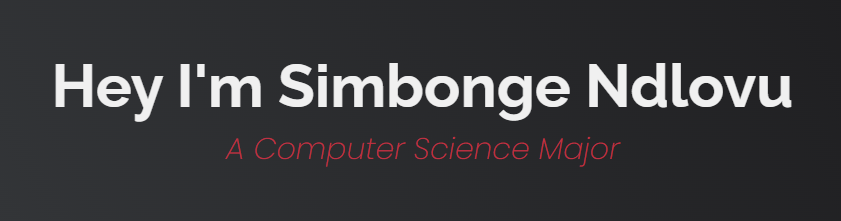

# Hey there :wave:

 
  Visitor count 
  

I'm a passionate computer science student at University of Kwazulu-Natal, South Africa, majoring in computer science. I love diving into the world of code and building exciting projects. In my free time, you'll find me exploring the realms of ethical hacking through CTF games like [OverTheWire](https://overthewire.org/wargames/), where I hone my skills and learn by doing.

## About Me

- 🎓 **Education:** Currently pursuing a degree in Computer Science at University of Kwazulu-Natal, South Africa.
- 💻 **Passion:** I'm deeply passionate about computer science and love to explore new technologies.
- 🌐 **CTF Enthusiast:** I enjoy playing Capture The Flag (CTF) games, and you can often find me on [OverTheWire](https://overthewire.org/wargames/) learning and practicing ethical hacking.
- ☕ **Java Community:** I'm an active member of the Java community on Discord. Join me on [Discord](https://discord.gg/together-java-272761734820003841), where I contribute, learn, and help fellow students with Java-related queries.

## Stat

<h3>Coding Environments:</h3>

    

### Programming Languages
- <code></code>
<code></code>
<code></code>
<code></code>
<code></code>
<code></code>
<h3>Version Control:</h3>

  

## Open Source and Collaboration
I'm enthusiastic about contributing to open source projects and always open to collaboration. If you have a project in mind or need a partner for your next idea, let's connect! Feel free to reach out to me via [email](mailto:simbongendlovu47@gmail.com) or [LinkedIn](https://www.linkedin.com/in/SimbongeNdlovu/).

Let's code together and build amazing things! 🚀

<!---
SimbongeN/SimbongeN is a ✨ special ✨ repository because its `README.md` (this file) appears on your GitHub profile.
You can click the Preview link to take a look at your changes.
--->
